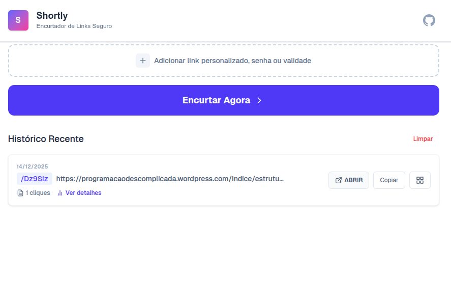

# Shortly – Encurtador de Links Seguro 🔗



O **Shortly** é uma aplicação moderna para encurtamento de URLs, desenvolvida com foco em performance, segurança e experiência do usuário. Diferente de encurtadores comuns, ele oferece recursos avançados como proteção por senha, data de expiração automática e geração de QR Codes, tudo em uma interface limpa e responsiva.

---

## 🚀 Funcionalidades

- **Encurtamento Rápido:** Gere links curtos aleatórios ou personalize seu próprio slug (ex: `shortly.com/minha-marca`).
- **QR Codes:** Gere e baixe QR Codes (SVG/PNG) instantaneamente para qualquer link.
- **Proteção por Senha:** Restrinja o acesso ao link final com uma senha criptografada.
- **Data de Validade:** Defina uma data e hora para o link expirar automaticamente.
- **Histórico Local:** Seus links recentes ficam salvos no navegador para acesso fácil.
- **Analytics:** Acompanhe a contagem de cliques e dados básicos de acesso (País, Cidade, Dispositivo).
- **Design Responsivo:** Interface moderna que funciona perfeitamente em desktop e mobile.

---

## 🛠️ Tecnologias Utilizadas

Este projeto foi construído com as melhores práticas de desenvolvimento web moderno:

- **[Next.js 15+](https://nextjs.org/)** (App Router & Server Actions)
- **[TypeScript](https://www.typescriptlang.org/)** (Tipagem estática para robustez)
- **[Tailwind CSS](https://tailwindcss.com/)** (Estilização utilitária e responsiva)
- **[Supabase](https://supabase.com/)** (Banco de dados PostgreSQL, Auth e Realtime)
- **bcryptjs** (Criptografia segura de senhas)
- **react-qr-code** (Geração de QR Codes vetorizados)
- **Geist Font** (Tipografia moderna da Vercel)

---

## 📦 Pré-requisitos

Antes de começar, certifique-se de ter instalado em sua máquina:

- [Node.js](https://nodejs.org/) (versão 18 ou superior)
- Git
- Uma conta gratuita no [Supabase](https://supabase.com/) para o banco de dados

---

## 🔧 Instalação e Configuração

### 1️⃣ Clone o repositório

```bash
git clone https://github.com/SEU_USUARIO/shortly.git
cd shortly
```

### 2️⃣ Instale as dependências

```bash
npm install
# ou
yarn install
```

### 3️⃣ Configure as Variáveis de Ambiente

Crie um arquivo chamado `.env.local` na raiz do projeto e preencha com as chaves do seu projeto Supabase (disponíveis em **Project Settings > API**):

```env
# URL base da aplicação (use localhost para desenvolvimento)
NEXT_PUBLIC_BASE_URL=http://localhost:3000

# Configurações do Supabase
NEXT_PUBLIC_SUPABASE_URL=sua_url_do_supabase_aqui
NEXT_PUBLIC_SUPABASE_ANON_KEY=sua_chave_anonima_aqui
SUPABASE_SERVICE_ROLE_KEY=sua_chave_service_role_aqui
```

> ⚠️ **Atenção:** A chave `SUPABASE_SERVICE_ROLE_KEY` é necessária para operações administrativas e **não deve ser exposta no lado do cliente**.

---

### 4️⃣ Configuração do Banco de Dados (SQL)

Vá até o **SQL Editor** no painel do seu projeto Supabase e execute o script abaixo. Ele criará as tabelas, funções e políticas de segurança necessárias:

```sql
-- 1. Tabela de URLs
create table urls (
  id bigint generated by default as identity primary key,
  created_at timestamp with time zone default timezone('utc'::text, now()) not null,
  target_url text not null,
  slug text not null unique,
  clicks int default 0,
  password_hash text,
  expires_at timestamp with time zone
);

-- 2. Tabela de Cliques (Analytics)
create table clicks (
  id bigint generated by default as identity primary key,
  created_at timestamp with time zone default timezone('utc'::text, now()) not null,
  url_slug text references urls(slug) not null,
  country text,
  city text,
  device text,
  referrer text
);

-- 3. Função RPC para incrementar cliques (Atomicidade e Segurança)
create or replace function increment_clicks(slug_input text)
returns void as $$
begin
  update urls set clicks = clicks + 1 where slug = slug_input;
end;
$$ language plpgsql;

-- 4. Políticas de Segurança (Row Level Security - RLS)
alter table urls enable row level security;
alter table clicks enable row level security;

-- Permitir leitura pública de URLs (necessário para o redirecionamento funcionar)
create policy "Enable read access for all users" on urls
for select using (true);

-- Permitir criação de URLs por qualquer usuário (anônimo ou logado)
create policy "Enable insert for all users" on urls
for insert with check (true);

-- Permitir inserção de logs de clique pelo sistema
create policy "Enable insert for analytics" on clicks
for insert with check (true);
```

---

### 5️⃣ Execute o projeto

```bash
npm run dev
```

Acesse: **http://localhost:3000** no seu navegador.

---

## 🚀 Como Fazer Deploy

A maneira mais fácil e recomendada é através da **Vercel** (criadores do Next.js):

1. Faça o push do seu código para o GitHub.
2. Crie um novo projeto na Vercel e importe seu repositório.
3. Nas configurações de **Environment Variables**, adicione as mesmas variáveis configuradas no `.env.local`.
4. Clique em **Deploy**.

---

## 📄 Termos e Privacidade

O projeto inclui páginas dedicadas para **Termos de Uso** e **Política de Privacidade**, essenciais para conformidade e aprovação em plataformas de anúncios como o Google AdSense:

- `/terms` – Termos de uso e política anti-abuso
- `/privacy` – Política de privacidade e uso de cookies

---

## 🤝 Contribuição

Contribuições são bem-vindas! Sinta-se à vontade para abrir uma **issue** ou enviar um **Pull Request** com melhorias.

---

## 📄 Licença

Este projeto está sob a licença **MIT**. Veja o arquivo `LICENSE` para mais detalhes.

---

Desenvolvido por </> **André Lima**
